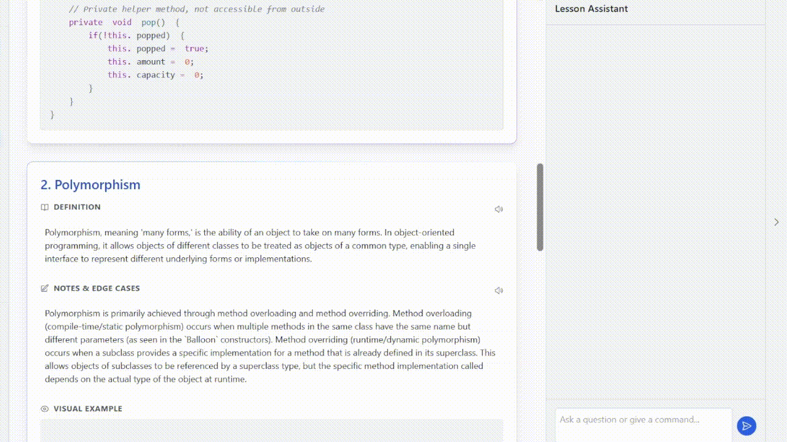

# Claricode

**Turn scattered course materials into structured, interactive lessons.**

Claricode is an AI-powered study tool that helps computer science students make sense of programming materials that aren't always presented in a cohesive way.

We built Claricode after running into a problem ourselves: a professor would provide collections of Java files as lecture material, but understanding how the files related to each other could take hours. We wanted to build something that could take those scattered materials and turn them into a structured learning experience.

→ [Try the live app](https://claricode.netlify.app/) · [Devpost](https://devpost.com/software/claricode)
<div align="center">
  
</div>

## What it does

### Structured Lessons

Upload course materials and Claricode organizes them into cohesive, reviewable lessons with definitions, annotated code snippets, explanations, and examples.

It supports a wide range of inputs, including:

* Python, Java, and C source files
* PDFs
* Images
* Other course materials

Generated lessons can also be customized with inline notes and highlighting.

### Context-Aware AI Tutor

Students can ask questions about their uploaded material and receive answers grounded in that material.

Rather than acting as a general-purpose chatbot, the tutor is embedded alongside the lesson so students can ask questions without losing their place or context.

### Accessibility

Claricode includes features designed to make the generated material easier to access and use:

* Text-to-speech
* High-contrast themes
* PDF export

## How It Works

At a high level, Claricode takes the student's course materials as input, processes them using the Gemini API, and turns them into structured lessons and examples that can be explored and personalized through the application.

The application is built with React and TypeScript, using Vite and Tailwind CSS for the frontend. Generated lessons can be exported as PDFs using jsPDF, and the application is deployed through Netlify.

## Building with AI

One of the biggest challenges we encountered was that getting an LLM to produce useful output was not as simple as sending it a prompt.

We had to account for ambiguous inputs, inconsistent output, and hallucinations, while still producing lessons that were structured and useful for students. This pushed us to think more carefully about how we prompted the model, how we handled its responses, and how much control we needed to maintain outside of the model itself.

Building Claricode was also our first experience working extensively with technologies like React and CSS, so the project involved learning new tools while building a working product under hackathon time constraints.

## Results

* **100+ students** used Claricode
* Generated **500+ structured lessons**
* 🏆 **Best Use of Gemini API — EmberHacks 2025**

## Tech Stack

* Frontend: React · TypeScript · Vite · Tailwind CSS
* AI: Google Gemini API
* Export: jsPDF
* Deployment: Netlify

## Running Locally

### Prerequisites

* Node.js
* A Gemini API key

### Setup

Clone the repository:

```bash
git clone https://github.com/RheaPaste1/Claricode.git
cd Claricode
```

Install dependencies:

```bash
npm install
```

Create a `.env.local` file and add your Gemini API key:

```env
GEMINI_API_KEY=your_api_key_here
```

Start the development server:

```bash
npm run dev
```

## The Team

Claricode was built collaboratively by **Rhea Paste** and [**Shreya Sirgound**](https://github.com/ShreyaSirgound) for EmberHacks 2025. We worked together across the project, from developing the application to figuring out how to make the AI-generated content useful and reliable for students.

---

Built by **Rhea Paste** and **Shreya Sirgound**.
